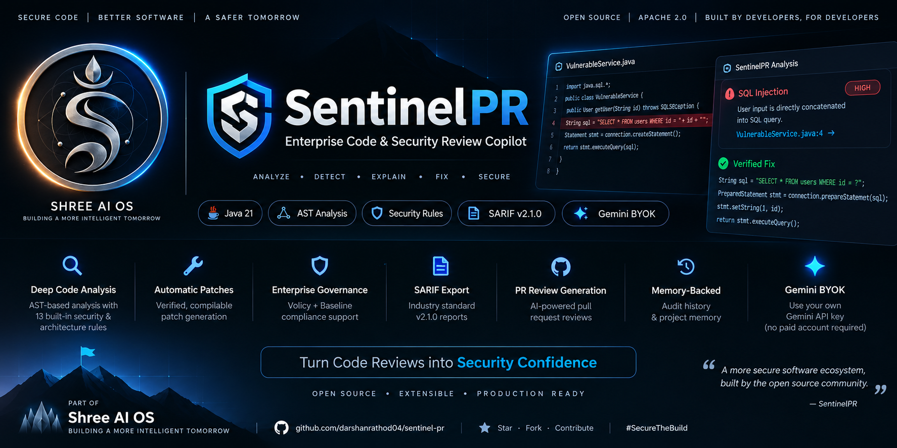
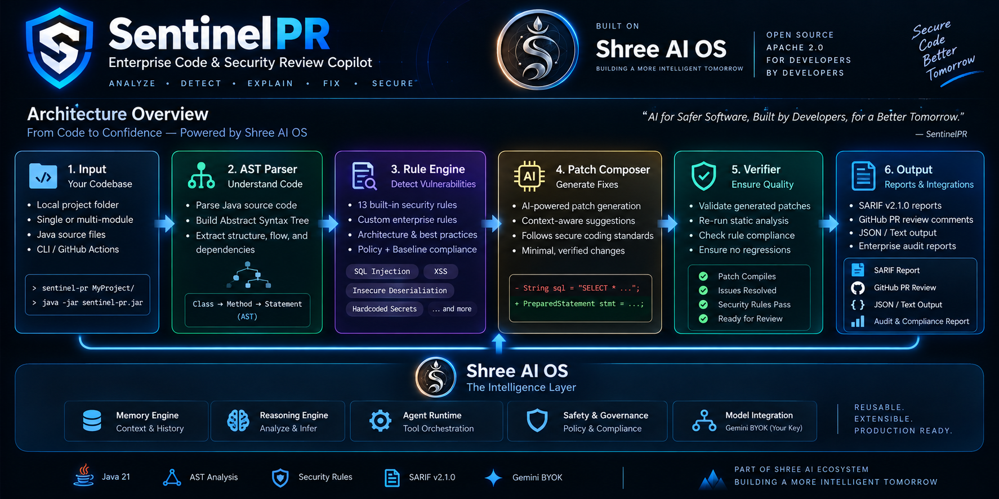
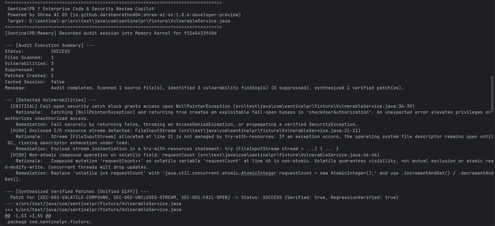
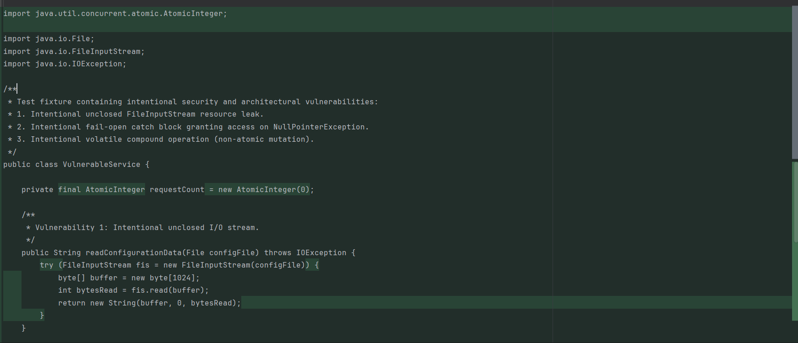
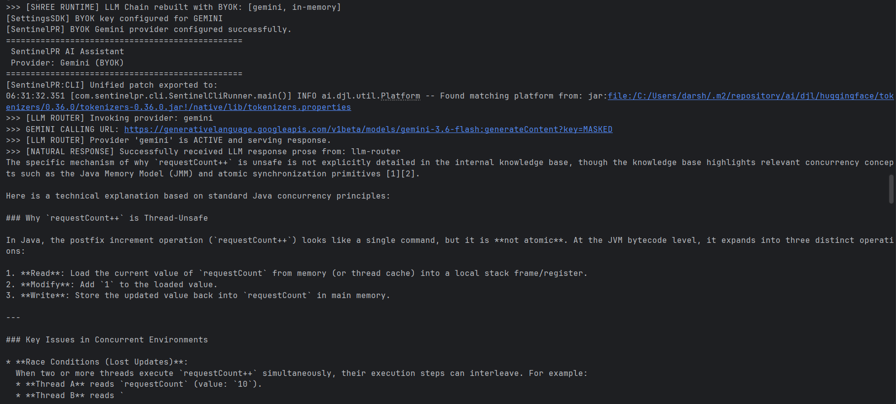

<p align="center">
  
</p>

# SentinelPR — Enterprise Code & Security Review Copilot

[](https://github.com/darshanrathod04/sentinel-pr/releases)
[](LICENSE)
[](https://github.com/darshanrathod04/sentinel-pr/actions)
[](https://www.oracle.com/java/technologies/downloads/#java21)
[](https://spring.io/projects/spring-boot)
[](https://github.com/darshanrathod04/shree-ai-os)
[](#verification)


**SentinelPR v1.1.0** is an enterprise code and security review copilot for Java codebases, built on top of the **Shree AI OS** cognitive operating system platform (`io.github.darshanrathod04:shree-ai-os:1.0.6-developer-preview`).

SentinelPR audits Java source at pull-request boundaries using deterministic AST analysis (JavaParser), intra-procedural taint tracking, causal root-cause reasoning, calibrated confidence scoring, and **verified** patch synthesis in standard unified diff format. Every audit can be governed by an enterprise policy, reconciled against an accepted technical-debt baseline, exported as OASIS SARIF v2.1.0 or a GitHub PR review payload, and recorded into a SHA-256-signed append-only audit ledger for SOC2 / ISO27001 evidence.

---


## Table of Contents

- [Features](#features)
- [Architecture](#architecture)
- [Installation](#installation)
- [Quick Start](#quick-start)
- [Gemini BYOK Setup](#gemini-byok-setup)
- [CLI Commands](#cli-commands)
- [Example Audit](#example-audit)
- [Example AI Chat](#example-ai-chat)
- [REST API](#rest-api)
- [Supported Rules](#supported-rules)
- [Verification](#verification)
- [Screenshots](#screenshots)
- [Documentation](#documentation)
- [Contributing](#contributing)
- [License](#license)

---

## Features

| Capability | Description |
|---|---|
| **AST security & architecture audit** | 13 rules (10 security + 3 architectural) evaluated on JavaParser ASTs at Java 21 language level |
| **Intra-procedural taint tracking** | `DataflowTracker` follows untrusted sources → sinks (SQL, command exec, file I/O) with sanitizer awareness |
| **False-positive suppression** | `@SuppressWarnings("sentinel:<RULE>")`, inline `// sentinel-ignore` comments, and `.sentinelignore` files |
| **Incremental PR diff filtering** | Only findings intersecting unified-diff hunk line ranges block the PR; the rest become diff-baseline debt |
| **Technical-debt baselines** | SHA-256 fingerprinted `.sentinelbaseline.json` snapshots with structural re-matching (±5 lines / same method) |
| **Enterprise policy engine** | Severity thresholds, blocked-rule supremacy (blocked rules cannot be hidden by baseline debt), unverified-patch gates |
| **Causal reasoning** | Multi-hop `Trigger → Propagation → Exploit Scenario → Business Impact` chains with blast-radius classification |
| **Calibrated confidence** | Deterministic 4-factor scoring (taint 0.35 / AST precision 0.30 / sanitizer absence 0.20 / reachability 0.15); findings below 0.70 are demoted, not blocking |
| **Verified patch synthesis** | One composed unified diff per file; every patch re-parsed and re-audited until **0 critical findings remain** |
| **SARIF v2.1.0 export** | GitHub Code Scanning / GitLab SAST / SonarQube compatible reports |
| **GitHub PR review payload** | `POST /repos/{owner}/{repo}/pulls/{pull_number}/reviews` body with inline comments and ```suggestion``` blocks |
| **Cryptographic audit trail** | Append-only NDJSON ledger with SHA-256 report signatures for SOC2-CC7.1 / ISO27001-A.12.6.1 |
| **Session memory & history** | Shree AI OS Memory Kernel plus a durable `.sentinelhistory.json` workspace ledger (metadata only — never source code) |
| **AI assistant chat** | `--chat` command routed through the Shree AI OS LLM router with Google Gemini BYOK |
| **REST API** | Spring Boot service exposing audit, SARIF, GitHub, policy, and governance endpoints |

---

## 🏗️ Architecture

<p align="center">
  
</p>

**SentinelPR** transforms Java source code into verified security fixes through a six-stage pipeline powered by **Shree AI OS**.

| Stage | Purpose |
|--------|---------|
| Input | Load project or Git diff |
| AST Parser | Build Abstract Syntax Tree |
| Rule Engine | Detect vulnerabilities |
| Patch Composer | Generate secure fixes |
| Verifier | Validate compilation & regressions |
| Output | SARIF, GitHub PR, JSON, Text |

SentinelPR is a Spring Boot application that runs both as an embedded CLI (`com.sentinelpr.cli.SentinelCliRunner`) and as a REST service (`/api/v1/sentinel/*`). Both front-ends share the same pipeline orchestrated by `SentinelAuditOrchestrator`:

```
CLI / REST
    │
    ▼
SentinelAuditOrchestrator
    ├─ CodeInspectionService      (AST parse via ProjectFacade / JavaParser)
    ├─ RuleEvaluationService      (ReasoningFacade rules + ArchitectureReviewEngine)
    ├─ SuppressionManager         (annotations / inline comments / .sentinelignore)
    ├─ IncrementalDiffScanner     (PR hunk filtering)
    ├─ BaselineManager            (technical-debt reconciliation)
    ├─ CausalAnalysisEngine       (root-cause chains)
    ├─ ConfidenceCalibrator       (4-factor calibrated scoring)
    ├─ AutomatedPatchService      (PatchComposer → PatchVerifier)
    └─ ReviewSessionMemory        (fingerprint dedup via MemorySDK)
    │
    ▼
Exports: JSON · SARIF 2.1.0 · GitHub PR payload · NDJSON audit ledger
```

All LLM capabilities (chat, reasoning) are delegated to the **Shree AI OS** 10-SDK surface (`ShreeAI`, `ProjectSDK`, `MemorySDK`, `SettingsSDK`, …). SentinelPR never calls Gemini APIs directly. See [docs/ARCHITECTURE.md](docs/ARCHITECTURE.md) for Mermaid diagrams of the CLI flow, audit pipeline, patch verification, governance engine, memory subsystem, and LLM routing.

---

## Installation

### Prerequisites

| Requirement | Version |
|---|---|
| JDK | 21 LTS |
| Maven | 3.9+ |
| Google Gemini API key | optional (BYOK) |

### Build

```bash
git clone https://github.com/darshanrathod04/sentinel-pr.git
cd sentinel-pr
mvn clean install -DskipTests
```

### Run tests

```bash
mvn test
```

---

## ⚡ Quick Start (30 Seconds)

Create `.github/workflows/sentinel-pr.yml`

```yaml
name: SentinelPR Security Gate

on:
  pull_request:
    types: [opened, synchronize, reopened]

permissions:
  contents: read
  pull-requests: write

jobs:
  audit:
    runs-on: ubuntu-latest

    steps:
      - uses: actions/checkout@v4
        with:
          fetch-depth: 0

      - uses: darshanrathod04/sentinel-pr@v1.1.0
        with:
          github_token: ${{ secrets.GITHUB_TOKEN }}
          gemini_api_key: ${{ secrets.GEMINI_API_KEY }}
          fail_on_critical: "true"
```

## Gemini BYOK Setup

SentinelPR uses **Bring Your Own Key** — you supply your own Google Gemini API key; it is configured through the Shree AI OS `SettingsSDK`, never hardcoded and never sent anywhere except the Gemini endpoint selected by the platform router.

```bash
# Linux / macOS
export GEMINI_API_KEY="your-gemini-api-key"

# Windows PowerShell
$env:GEMINI_API_KEY = "your-gemini-api-key"
```

| Environment variable | Required | Default | Purpose |
|---|---|---|---|
| `GEMINI_API_KEY` | No | *(empty)* | Google Gemini BYOK key; when absent SentinelPR runs in deterministic in-memory provider mode |
| `SHREE_API_KEY` | No | `local` | Shree AI OS platform bootstrap key (`SentinelClient.bootstrap`) |

Behavior (from `SentinelClient.bootstrap()`):

- `GEMINI_API_KEY` set → `[SentinelPR] BYOK Gemini provider configured successfully.`
- `GEMINI_API_KEY` missing → `[SentinelPR] No GEMINI_API_KEY provided; operating in deterministic in-memory provider mode.`
- If provider configuration fails, SentinelPR automatically falls back to the in-memory provider chain — audits keep working deterministically.

The `--chat` assistant and all reasoning pipelines route through the same LLM router; no API calls bypass the platform.

---

## CLI Commands

Usage: `java -jar sentinel-pr.jar <target-path> [options]` (or via Maven `exec:java`).

| Option | Description |
|---|---|
| `<target-path>` | Java file or directory to audit |
| `--diff <patch-file>` | Enable incremental git diff scanning |
| `--baseline <baseline-file>` | Filter findings against a technical-debt baseline |
| `--create-baseline <out.json>` | Export findings as a baseline snapshot |
| `--policy <policy-file>` | Enforce enterprise compliance policy thresholds |
| `--sarif <output-file>` | Export OASIS SARIF v2.1.0 report |
| `--audit-log <ledger.log>` | Append a signed cryptographic audit entry |
| `--history` | Display review session history from Memory Kernel |
| `--run <run-id>` | Inspect detailed metadata for a specific session |
| `--chat "<prompt>"` | Ask the SentinelPR AI assistant (Gemini BYOK) |
| `-f, --format <format>` | Output format: `json` (default), `sarif`, `github`, `text` |

Full reference with examples and expected output: [docs/CLI.md](docs/CLI.md).

---

## Example Audit

<p align="center">
  
</p>


```bash
mvn -q compile exec:java \
  "-Dexec.mainClass=com.sentinelpr.cli.SentinelCliRunner" \
  "-Dexec.args=src/test/java/com/sentinelpr/fixture/VulnerableService.java"
```

Actual console output (trimmed):

```text
================================================================================
 SentinelPR — Enterprise Code & Security Review Copilot
 Powered by Shree AI OS (io.github.darshanrathod04:shree-ai-os:1.0.6-developer-preview)
 Target: D:\projects\sentinel-pr\src\test\java\com\sentinelpr\fixture\VulnerableService.java
================================================================================

--- [Audit Execution Summary] ---
Status:          SUCCESS
Files Scanned:   1
Vulnerabilities: 3
Suppressed:      0
Patches Created: 1
Cached Session:  false
Message:         Audit completed. Scanned 1 source file(s), identified 3 vulnerability finding(s) (0 suppressed), synthesized 1 verified patch(es).

--- [Detected Vulnerabilities] ---
  [CRITICAL] Fail-open security catch block grants access upon NullPointerException (…VulnerableService.java:36-39)
    Rationale:   Catching an unhandled exception or null reference and returning true …
    Remediation: Convert the handler to fail-closed semantics …
  ...

--- [Synthesized Verified Patches (Unified Diff)] ---
  Patch for [SEC-003-VOLATILE-COMPOUND, SEC-002-UNCLOSED-STREAM, SEC-001-FAIL-OPEN]
      -> Status: SUCCESS (Verified: true, RegressionVerified: true)
--- a/src/test/java/com/sentinelpr/fixture/VulnerableService.java
+++ b/src/test/java/com/sentinelpr/fixture/VulnerableService.java
@@ ...
```

### Verified Patch Generation

<p align="center">
  
</p>

---

## Example AI Chat

```bash
mvn -q compile exec:java \
  "-Dexec.mainClass=com.sentinelpr.cli.SentinelCliRunner" \
  "-Dexec.args=--chat Explain why requestCount++ is unsafe in Java"
```

### AI Security Assistant (Gemini BYOK)

<p align="center">
  
</p>

```text
================================================
 SentinelPR AI Assistant
 Provider: Gemini (BYOK)
================================================

<model response…>
```

Everything after `--chat` becomes one prompt. Running `sentinel --chat` with no prompt prints `Error: Missing chat prompt.` with usage and exits with code `3`. *(Note: SDK runtime initialization logs emitted by Shree AI OS may also appear on the console; they originate in the platform, not the CLI.)*

---

## REST API

Base path: `/api/v1/sentinel` (default port `8080`).

| Endpoint | Method | Description |
|---|---|---|
| `/health` | GET | Health check, rule counts, platform metadata |
| `/review` | POST | Full audit (path, source code, or diff). Formats: `json` / `sarif` / `github` / `text` |
| `/review/sarif` | POST | Audit returning SARIF v2.1.0 |
| `/review/github` | POST | Audit returning a GitHub PR review payload |
| `/policy/evaluate` | POST | Evaluate a report (or target path) against a policy |
| `/governance/status` | GET | Active governance configuration and compliance standards |

---

## Supported Rules

| Rule ID | Severity | Title |
|---|---|---|
| `SEC-001-FAIL-OPEN` | CRITICAL | Fail-open security block (CWE-393) |
| `SEC-002-UNCLOSED-STREAM` | HIGH | Unclosed I/O stream (CWE-404) |
| `SEC-003-VOLATILE-COMPOUND` | HIGH | Non-atomic volatile compound operation (CWE-362) |
| `SEC-004-UNISOLATED-SUBPROCESS` | CRITICAL | Un-isolated subprocess call (CWE-78) |
| `SEC-005-SQL-INJECTION` | CRITICAL | SQL injection (CWE-89) |
| `SEC-006-PATH-TRAVERSAL` | CRITICAL | Path traversal (CWE-22) |
| `SEC-007-INSECURE-DESERIALIZATION` | CRITICAL | Insecure deserialization (CWE-502) |
| `SEC-008-HARDCODED-SECRET` | HIGH | Hardcoded secret or token (CWE-798) |
| `SEC-009-SPRING-SECURITY-CSRF-DISABLED` | HIGH | Spring Security CSRF disabled (CWE-352) |
| `SEC-010-SPRING-PERMISSIVE-CORS` | MEDIUM | Spring permissive CORS policy (CWE-942) |
| `ARCH-001-CYCLIC-DEPENDENCY` | MEDIUM | Architectural cyclic dependency (CWE-1047) |
| `ARCH-002-LEAKY-ABSTRACTION` | HIGH | Leaky entity abstraction in REST controller (CWE-497) |
| `ARCH-003-NON-DETERMINISTIC-CALL` | MEDIUM | Non-deterministic time/random invocation |

Full detection logic, vulnerable/fixed examples, and remediations: [docs/SECURITY.md](docs/SECURITY.md).

---

## Verification

36 integration tests across six suites, all passing:

```
mvn test
[INFO] Tests run: 36, Failures: 0, Errors: 0, Skipped: 0
[INFO] BUILD SUCCESS
```

| Suite | Focus |
|---|---|
| `SentinelPrApplicationTest` | Application bootstrap & REST contract |
| `SentinelPrP0VerificationTest` | Taint engine, suppression, atomic patch composition, regression verification |
| `SentinelPrP1SecurityVerificationTest` | Core SEC-001…003 rule correctness |
| `SentinelPrP2WorkflowVerificationTest` | CLI workflow, history, export formats |
| `SentinelPrP3GovernanceVerificationTest` | Baselines, policy engine, audit trail, SARIF |
| `SentinelPrP4IntelligenceVerificationTest` | Causal chains, calibration, multi-file planning, ARCH rules |

---

## Screenshots

### Security Audit


### Verified Patch Diff


### AI Security Assistant

---

## Documentation

| Document | Contents |
|---|---|
| [docs/ARCHITECTURE.md](docs/ARCHITECTURE.md) | Internal architecture with Mermaid diagrams |
| [docs/CLI.md](docs/CLI.md) | Every CLI command, examples, exit codes |
| [docs/SECURITY.md](docs/SECURITY.md) | Rule catalog: detection logic, examples, remediations |
| [docs/GOVERNANCE.md](docs/GOVERNANCE.md) | Baselines, policy engine, blocked rules, audit trail, signatures |
| [docs/CLI.md](docs/CLI.md) · [USAGE_GUIDE.md](docs/USAGE_GUIDE.md) | Command reference & CI/CD GitHub Actions template |
| [CHANGELOG.md](CHANGELOG.md) | Semantic version history |
| [CONTRIBUTING.md](CONTRIBUTING.md) | Contribution workflow |

---

## Contributing

Pull requests are welcome. Read [CONTRIBUTING.md](CONTRIBUTING.md) for the developer workflow: branch naming, `mvn test` gate, rule-addition checklist, and commit conventions.

---

## License

**Apache License 2.0.** The official license text is committed at [`LICENSE`](LICENSE). See [docs/LICENSE-RECOMMENDATION.md](docs/LICENSE-RECOMMENDATION.md) for the rationale and remaining follow-ups (optional `NOTICE` file and `pom.xml` `<licenses>` block).
