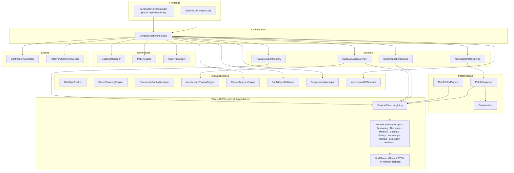
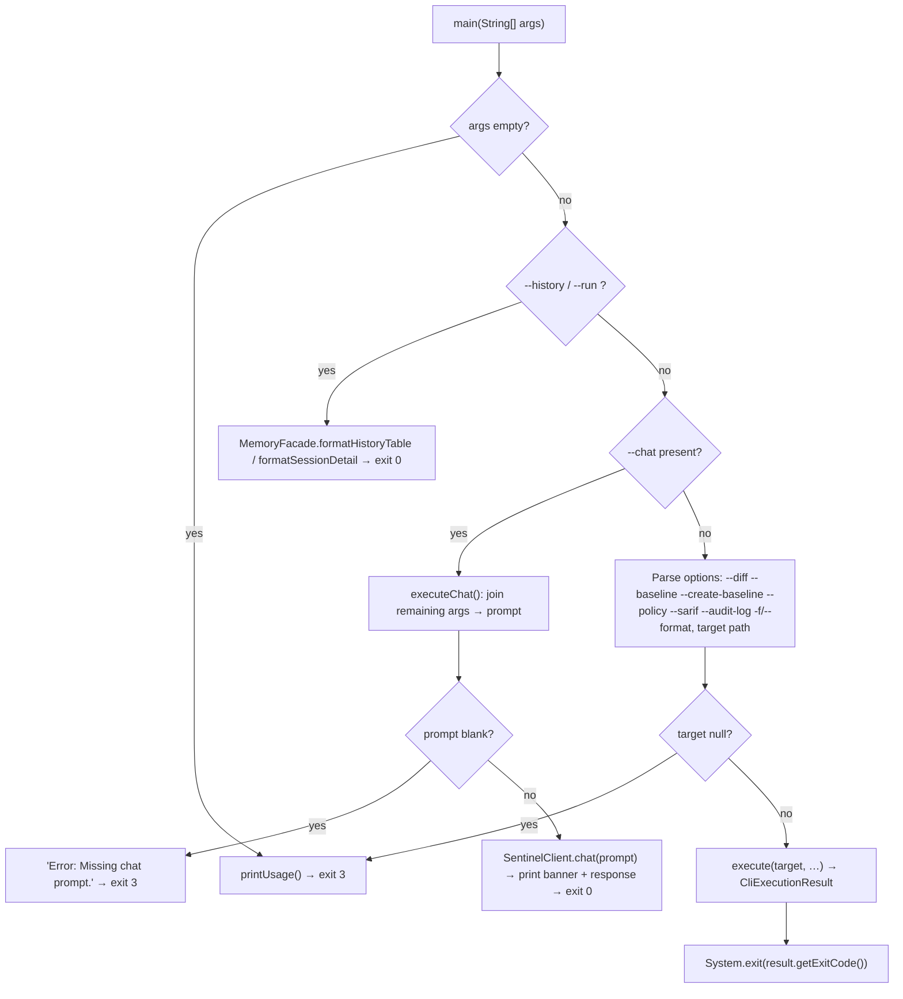
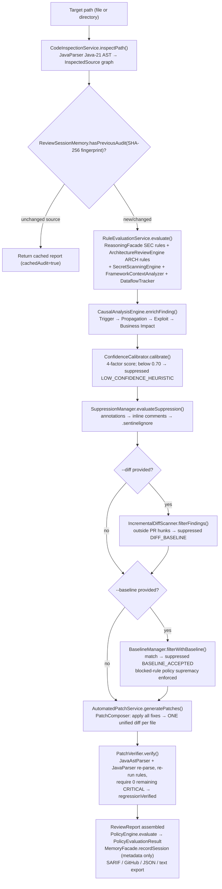
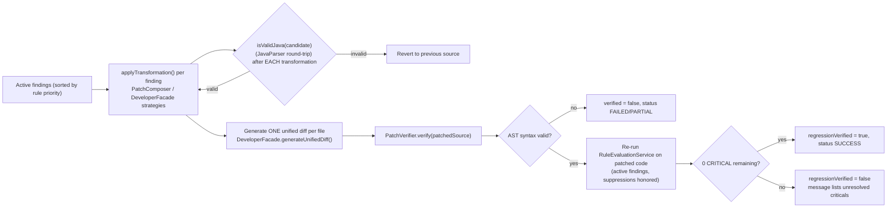
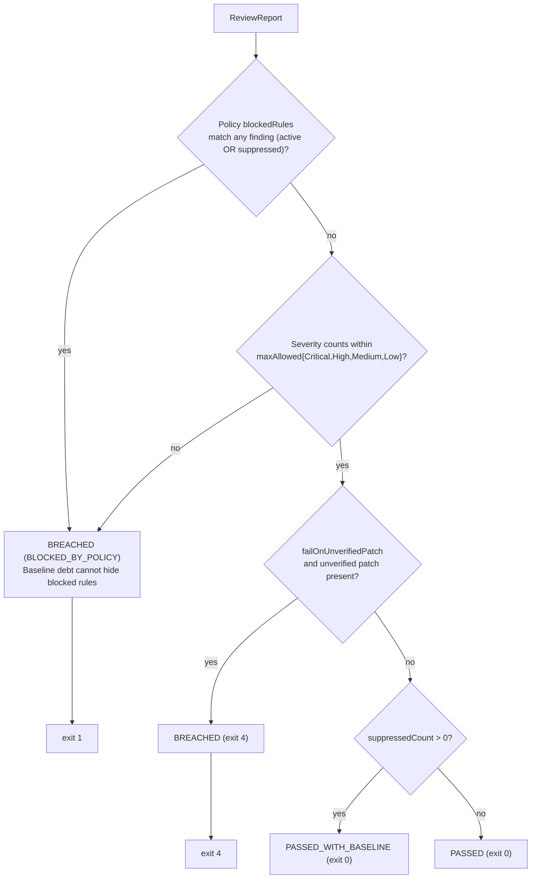
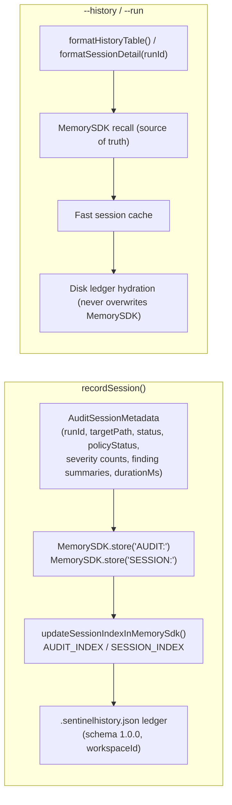
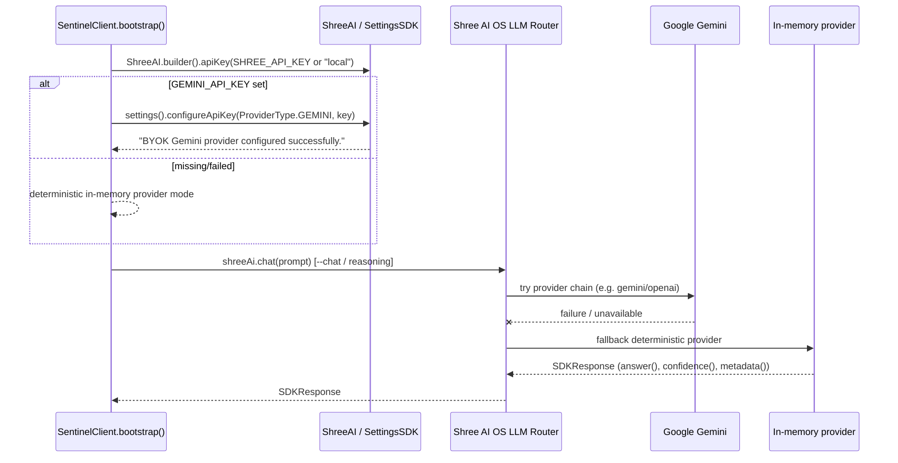

# SentinelPR — Internal Architecture

> Derived entirely from the v1.0.0 source tree (`src/main/java`). Every component named here exists in the codebase.

## 1. Module Overview

| Package | Responsibility |
|---|---|
| `com.sentinelpr` | Spring Boot bootstrap (`SentinelPrApplication`) and bean wiring |
| `com.sentinelpr.cli` | Command-line front-end (`SentinelCliRunner`) |
| `com.sentinelpr.api` | REST front-end (`SentinelReviewController`, DTOs) |
| `com.sentinelpr.client` | Shree AI OS integration layer (`SentinelClient`, facades, `MemoryFacade`) |
| `com.sentinelpr.core.analysis` | Taint tracking, secret scanning, framework analysis, diff scanning, suppression, causal analysis, calibration |
| `com.sentinelpr.core.analysis.architecture` | `ArchitectureReviewEngine` (ARCH rules) |
| `com.sentinelpr.core.service` | Orchestrator, inspection, rule evaluation, patch composition/verification, session memory |
| `com.sentinelpr.core.model` | Domain models (`ReviewReport`, `SecurityFinding`, `UnifiedDiffPatch`, …) |
| `com.sentinelpr.core.governance` | Baseline snapshots, policy engine, cryptographic audit trail |
| `com.sentinelpr.core.export` | SARIF 2.1.0 generator, GitHub PR review payload builder |

## 2. Layer Diagram

## 3. CLI Request Flow

Exit codes (`execute(String[])` javadoc): `0` audit passed / history · `1` policy breached · `2` internal engine error · `3` invalid CLI arguments, missing target, or missing chat prompt · `4` patch generation/verification failure.

## 4. Audit Pipeline

Implemented in `SentinelAuditOrchestrator.auditPath(...)` and `auditSources(...)`:

Session deduplication: `ReviewSessionMemory.computeFingerprint` hashes raw source text with SHA-256; recall key is `AUDIT:<fingerprint>`; both a fast in-process `ConcurrentHashMap` cache and the Memory Kernel are consulted.

## 5. Patch Synthesis & Verification

Patch strategies (one per rule, in `PatchComposer` / `DeveloperFacade`):

| Rule | Transformation |
|---|---|
| SEC-001-FAIL-OPEN | `return true;` → `return false; // SentinelPR: fail-closed security fix` (or equivalent hardening) |
| SEC-002-UNCLOSED-STREAM | Wrap stream in try-with-resources |
| SEC-003-VOLATILE-COMPOUND | `volatile int` + `++` → `AtomicInteger` with `incrementAndGet()` |
| SEC-004-UNISOLATED-SUBPROCESS | `Runtime.getRuntime().exec(` → `new ProcessBuilder(` |
| SEC-005-SQL-INJECTION | Concatenated SELECT predicate → `?` placeholder (developer completes `PreparedStatement` parameterization) |
| SEC-006-PATH-TRAVERSAL | Inject `Path.of(base.toString(), arg).normalize()` + base-path containment check throwing `SecurityException` (or `new File(base, arg).getCanonicalFile()` variant) |
| SEC-007-INSECURE-DESERIALIZATION | Inject `ObjectInputFilter.Config.createFilter("java.lang.*;java.util.*;!*")` on the `ObjectInputStream` |
| SEC-008-HARDCODED-SECRET | Literal → `System.getenv("AWS_ACCESS_KEY_ID")` / `System.getenv("APP_SECRET")` |
| SEC-009-SPRING-SECURITY-CSRF-DISABLED | Replace flagged snippet with `// CSRF protection preserved` marker (safe rewrite is a developer action) |
| SEC-010-SPRING-PERMISSIVE-CORS | `@CrossOrigin(origins = "*")` / `addAllowedOrigin("*")` → `https://trusted.domain.com` |

Every candidate patch is parsed again after each edit; invalid candidates are rolled back so the composed diff always re-parses as valid Java 21.

## 6. Governance Engine

Baseline matching (`BaselineEntry.matches`) succeeds on either an exact SHA-256 fingerprint of `filePath|ruleId|methodName|snippet` or a structural match (same file + same rule + same method **or** start line within ±5). `AuditTrailLogger` produces NDJSON entries signed with a SHA-256 over the canonical payload `runId|timestamp|targetPath|inputFingerprint|policyStatus|active|suppressed|blocked|patches|ruleSetVersion|policyVersion`; `verifyAuditEntry` recomputes and compares the signature. Operator identity resolves from `GITHUB_ACTOR` → `USER` → `USERNAME` → `user.name`.

## 7. Memory Subsystem

**Guardrail (enforced in code, documented on `MemoryFacade`):** only audit *metadata* is persisted — never raw source code, unified diffs, or patch bodies.

## 8. LLM Routing & Gemini BYOK

- SentinelPR calls only `SentinelClient.chat(...)` / facades; no direct HTTP to Gemini anywhere in this repository.
- `SDKResponse` exposes `answer()` (there is no `content()` method on the 1.0.6 SDK).
- Provider-chain order and degraded-mode behavior are owned by the Shree AI OS platform, not SentinelPR.

## 9. REST API Surface

| Endpoint | Backing components |
|---|---|
| `GET /api/v1/sentinel/health` | Rule counts (`SecurityRule.getCoreSecurityRulesCount()`), platform version |
| `POST /api/v1/sentinel/review` | `SentinelAuditOrchestrator.auditPath / auditSourceCode / auditPathWithDiff …` |
| `POST /api/v1/sentinel/review/sarif` | Same + `SarifReportGenerator` |
| `POST /api/v1/sentinel/review/github` | Same + `PrReviewCommentBuilder` |
| `POST /api/v1/sentinel/policy/evaluate` | `PolicyEngine.evaluate` |
| `GET /api/v1/sentinel/governance/status` | Static governance metadata (SOC2-CC7.1, ISO27001-A.12.6.1, OWASP-TOP-10, CWE-SANS-TOP-25) |

## 10. Documented Gaps (as found in the repository)

- No `.github/` workflows are committed; `USAGE_GUIDE.md` contains only an example GitHub Actions template.
- No `examples/` directory; runnable examples live in `src/test/java/com/sentinelpr/fixture/` and `src/test/resources/`.
- No `LICENSE` file despite the Apache-2.0 badge (see `docs/LICENSE-RECOMMENDATION.md`).
- No screenshot assets (`docs/screenshots/` does not exist).
- `apps/sentinel-pr/` contains copies of `README.md` and `USAGE_GUIDE.md` that can drift from the root versions.
- `AuditTrailEntry.ExecutionTimings` uses fixed default timings (parse 15 / analysis 35 / patch 20 / total 70 ms) rather than measured values.
