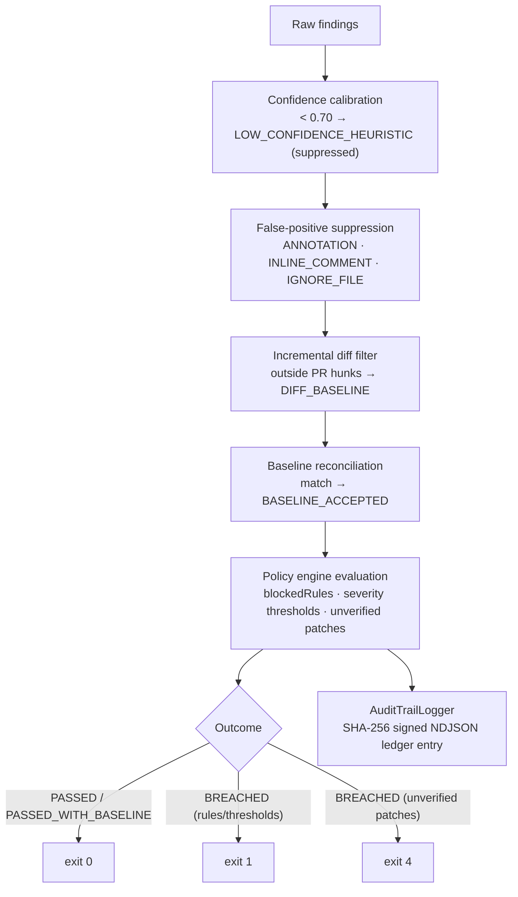

# SentinelPR — Governance, Baselines & Audit Trail (v1.0.0)

This document describes the compliance machinery implemented in `com.sentinelpr.core.governance` and how the audit pipeline uses it. Everything here is derived from the implementation; behavior that is fixed by code (defaults, constants) is stated as such.

## 1. Governance Workflow Overview



Order of operations in `SentinelAuditOrchestrator`: calibration → suppression → diff filtering → baseline reconciliation → patch synthesis → policy evaluation → exports → audit logging → memory recording.

## 2. Baseline Snapshots (Technical Debt)

**Files:** `BaselineManager`, `BaselineSnapshot`, `BaselineEntry` (`core/governance/baseline/`).

- **Create:** `--create-baseline <out.json>` captures every *active* finding of the current run.
- **Apply:** `--baseline <file>` reconciles new findings against the snapshot; matches are suppressed with type `BASELINE_ACCEPTED`.
- **Schema:** version `1.0` (`BaselineSnapshot.CURRENT_VERSION`), `createdAt`, `targetPath`, `totalEntries`, `entries[]` with `fingerprint`, `filePath`, `ruleId`, `startLine`, `endLine`, `className`, `methodName`, `snippet`, `capturedAt`.

**Fingerprinting.** `BaselineEntry.computeFingerprint` builds the canonical payload

```
normalizedFilePath | ruleId | methodName | whitespace-collapsed snippet
```

and hashes it with SHA-256 (first 32 hex characters stored). Paths are normalized to forward slashes with leading `/` stripped.

**Matching (`BaselineEntry.matches`).** A finding matches a baseline entry if either:

1. **Exact fingerprint match**, or
2. **Structural match** — same file (case-insensitive, either path may be a suffix of the other) *and* same rule ID, where additionally the method name is equal **or** the start lines differ by ≤ 5.

Structural matching means harmless refactors (imports, comments, small line shifts) do not resurrect accepted debt.

**Policy supremacy.** When a policy is supplied (`filterWithBaseline(findings, baseline, policy)`), findings whose rule ID is in `policy.blockedRules` are **never** suppressed by the baseline — they stay active regardless of the snapshot.

Default filename constant: `BaselineManager.DEFAULT_BASELINE_FILENAME = ".sentinelbaseline.json"`.

## 3. Policy Engine

**Files:** `PolicyEngine`, `SentinelPolicy`, `PolicyEvaluationResult` (`core/governance/policy/`).

### 3.1 Policy schema (`SentinelPolicy`)

| Field | Type | Default (if omitted) | Meaning |
|---|---|---|---|
| `policyName` | string | `Enterprise-Strict-Security-Policy` | Identifier in reports/ledgers |
| `version` | string | `1.0` | Policy version recorded in audit entries |
| `maxAllowedCritical` | int | `0` | Max active CRITICAL findings |
| `maxAllowedHigh` | int | `0` | Max active HIGH findings |
| `maxAllowedMedium` | int | `-1` (unlimited) | Max active MEDIUM findings |
| `maxAllowedLow` | int | `-1` (unlimited) | Max active LOW findings |
| `failOnUnverifiedPatch` | bool | `true` | Breach when any synthesized patch is unverified/failed |
| `blockedRules` | list | `[]` | Rule IDs that can never pass (see 3.2) |
| `requiredTags` | list | `["OWASP-TOP-10"]` | Compliance tags recorded with the policy |

Built-in presets: `SentinelPolicy.createDefaultStrictPolicy()` (0 critical / 0 high) and `createPermissivePolicy()` (`Permissive-Dev-Policy`, 10/10/20/50, no fail-on-unverified-patch). Policies load from JSON via `PolicyEngine.loadPolicy(Path)`.

### 3.2 Blocked rules & policy supremacy

`PolicyEngine.evaluate` checks `blockedRules` **first**, across **all** findings — active *and* suppressed/baseline debt:

- Active finding on a blocked rule → `Policy breach: Finding violates strictly blocked rule [<RULE>] … (BLOCKED_BY_POLICY)`
- Suppressed/baseline finding on a blocked rule → `Policy breach: Finding present in baseline debt violates strictly blocked rule [<RULE>] … (BLOCKED_BY_POLICY: Baseline cannot suppress blocked rules)`

Consequence: an organization can declare e.g. `SEC-001-FAIL-OPEN` non-negotiable — no amount of historical debt or diff filtering can hide it.

### 3.3 Outcomes

| Status | Trigger | Exit code |
|---|---|---|
| `PASSED` | No violations, no suppressed items | `0` |
| `PASSED_WITH_BASELINE` | No violations; baseline debt accepted | `0` |
| `BREACHED` | Thresholds exceeded, blocked rule present, or unverified patches with `failOnUnverifiedPatch=true` | `1` (or `4` when `unverifiedPatchCount > 0`) |
| `FAILED` | Internal engine error | `2` |

The CLI prints breaches to **stderr** with `❌` per violation and uses `PolicyEvaluationResult.getExitCode()` as the process exit code.

## 4. Suppression & Diff Filtering (pre-governance layers)

Three suppression channels are evaluated before baseline and policy (types recorded in `SuppressedFinding.suppressionType`):

1. **`ANNOTATION`** — `@SuppressWarnings("sentinel:SEC-001-FAIL-OPEN")` or `@SuppressWarnings("sentinel:all")` on the enclosing method/class/field.
2. **`INLINE_COMMENT`** — `// sentinel-ignore SEC-001 [reason]` on the finding line or the line above (block comments also recognized).
3. **`IGNORE_FILE`** — `.sentinelignore` resolved from the target directory upward (or the provided root): lines may name rule tokens (`SEC-001`, `sentinel:all`, `*`) or file names (whole-file exclusion).

Rule tokens match full IDs (`sec-001-fail-open`), enum names (`fail_open_security`), or short prefixes (`sec-001`).

**Diff filtering** (`IncrementalDiffScanner`, type `DIFF_BASELINE`): the unified diff is parsed into per-file hunks; a finding is *active* only when its `[startLine, endLine]` range intersects a hunk's added/modified lines. Files absent from the diff → all their findings become diff-baseline. Empty/absent diff → everything stays active.

## 5. Cryptographic Audit Trail

**Files:** `AuditTrailLogger`, `AuditTrailEntry` (`core/governance/audit/`).

`--audit-log <ledger.log>` appends exactly one JSON line (**NDJSON**, indentation disabled) per run:

```json
{"runId":"REV-1a2b3c4d","timestamp":"2026-09-22T03:25:00Z","targetPath":"src/main/java",
 "commitId":"HEAD","branch":"main","operator":"darshan","inputFingerprint":"<sha256>",
 "reportSignature":"<sha256>","memoryKernelFingerprint":"<hash>","rulesActive":10,
 "modelProvider":"Shree AI OS (deterministic)","policyStatus":"BREACHED",
 "totalFindings":3,"totalPatches":1,"activeFindings":3,"suppressedFindings":0,
 "blockedFindings":1,"ruleSetVersion":"v1.0.0","policyVersion":"v1.0",
 "executionTimings":{"parseMs":15,"analysisMs":35,"patchMs":20,"totalMs":70}}
```

**Signatures.** `reportSignature` = SHA-256 over the canonical pipe-joined payload:

```
runId | timestamp(ISO-8601) | targetPath | inputFingerprint | policyStatus |
activeFindings | suppressedFindings | blockedFindings | patchesCount |
ruleSetVersion | policyVersion
```

`AuditTrailLogger.verifyAuditEntry(entry, path)` recomputes the signature from the serialized entry and returns `true` only on an exact match — enabling tamper detection for auditors. `inputFingerprint` is the SHA-256 of the target *file's content* (files) or of the target path string (directories).

**Operator identity** resolves in order: `GITHUB_ACTOR` → `USER` → `USERNAME` → `user.name` system property → `"sentinel-agent"`.

**Documented limitation:** `ExecutionTimings` values are fixed defaults (`parseMs=15, analysisMs=35, patchMs=20, totalMs=70` via `createDefault()`), not measured durations; the wall-clock duration is tracked separately for the Memory Kernel (`MemoryFacade.recordSession(durationMs)`).

## 6. Compliance Mapping

`GET /api/v1/sentinel/governance/status` reports the standards the ledger is designed to evidence:

- **SOC2-CC7.1** — audit trail of configuration/scan changes (immutable signed entries)
- **ISO27001-A.12.6.1** — management of technical vulnerabilities (finding → patch → verification ledger)
- **OWASP-TOP-10** and **CWE-SANS-TOP-25** — rule coverage via CWE-tagged rules

Supported enforcement loop: audit → policy gate (exit codes CI-friendly) → baseline acceptance of debt → blocked-rule supremacy for hard guarantees → signed ledger for evidence.

## 7. Workspace Artifacts

| File | Produced by | Content |
|---|---|---|
| `.sentinelhistory.json` | `MemoryFacade` | Versioned (`1.0.0`) session ledger: run metadata, severity counts, finding summaries. **Never** source code or patches |
| `local-baseline.json` | `--create-baseline` (user-chosen name) | Accepted technical debt snapshot |
| `strict-policy.json` | user-authored | Enterprise policy definition |
| `compliance-audit.log` | `--audit-log` (user-chosen name) | Signed NDJSON audit ledger |
